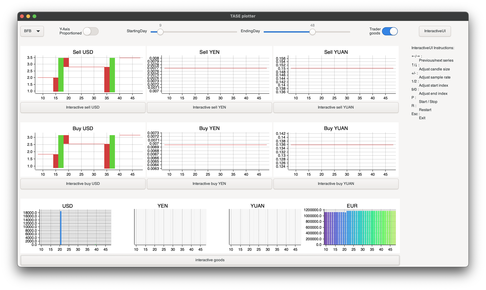

# Trader bot and market visualizer made with GTK 

This is a plot visualizer that shows the variation of prices (sell price the first graph row, buy price the second one) and the liquidity of the markets and eventually of the trader.

- The top-left button allows to switch between all the different markets.
- The "Y-Axis Proportioned" switch allows you to resize all the graphs fixing the y-axis
- The two scales let you change the days you are currently displaying
- The "Trader goods" switch substitutes the market goods with the trader goods
- The InteractiveUI button starts an interactive version of the graphs (commands are below the button)
- All the buttons below the graphs start the interactive version of that particular graph

For more detail about Plotters, see the core project repository at this [link](https://github.com/plotters-rs/plotters).

## Screenshot

